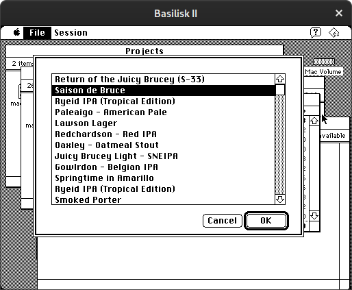

# macbrew
A project to use a m86k based Macs to help with homebrewing.

It combines my love of brewing beer with
my love of vintage computers.

I decided to do it to help me learn Rust
and to play with a vintage Mac and see
how software was developed 30 years ago.

Bonus points if it helps me brew better beer.

### macbrew-proxy
A modern application written in Rust that
will run on a Raspberry Pi
and load recipes/sessions from [Brewers Friend](https://www.brewersfriend.com/)
and translate them to a compact binary form.

It will expose a serial
interface for a Mac Plus to talk to
and fetch the data.

### macbrew-gui

A C application written
on a 30 year old IDE
on a Mac Plus (System 6)
It will use the serial port to talk to macbrew-proxy
and fetch data.

## Testing

### Unit Tests

```bash
$ cargo test
```

### Integration Test

You can set up a virtual serial port pair with:

```
$ socat -d -d pty,raw,echo=0 pty,raw,echo=0 &
```

Use `/dev/pts/1` as the target serial port for macbrew-proxy and
you can use the other side of the pair to push data through. E.g `tio /dev/pts/2`

### Architecture

Here is a rough diagram of the components in this system:


The MacBrew proxy runs on a Raspberry Pi and bridges the Brewers Friend API and the Mac.

The proxy needs to convert all the JSON (and BeerXML) coming from the Brewers Friend API into a compact binary form in big endian to make it more efficent for the m68k CPU in the Mac, and then pass the data via a serial interface.

### Screenshots

Some screenshots of the work in progress:




## License

[Hippocratic License 2.1](https://firstdonoharm.dev)
